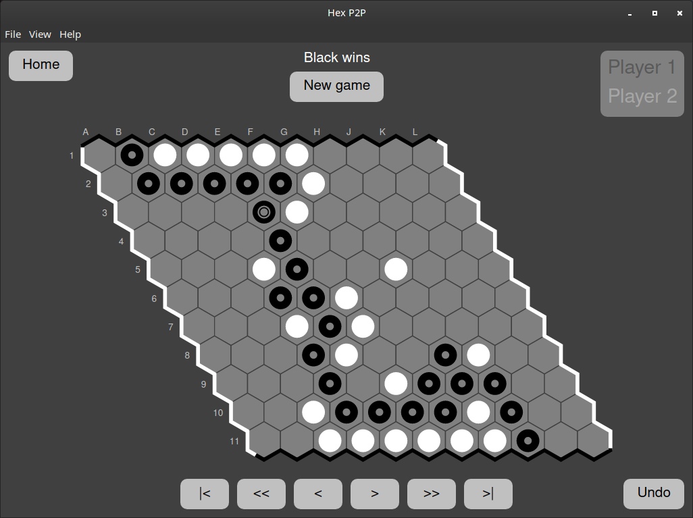

# Hex P2P

Peer-to-peer client for playing Hex over the Internet, or locally.

## Installation

### GNU/Linux

Download an AppImage file from [Releases](https://github.com/kevinsung/hexp2p/releases).

### Windows

Download a .exe file from [Releases](https://github.com/kevinsung/hexp2p/releases).

### Mac OS

Download a .dmg file from [Releases](https://github.com/kevinsung/hexp2p/releases).

## Rules of Hex

The players (Black and White) take turns selecting a hexagon to fill with their color.
A player wins when they have built a solid chain between the two edges of their color.
The screenshot at the top of this page demonstrates a winning configuration for Black.

### The swap rule

Normally, the game is played using the swap rule in order to mitigate the advantage of
playing first. Under the swap rule, Black makes the first move, and then White chooses
whether or not to swap pieces with Black. If White chooses to swap pieces, then Black's
move is replaced with the equivalent White move, and then it is Black's turn. Play then
continues as normal.

## License

Copyright (C) 2021 Kevin J. Sung.

Licensed under the AGPLv3. See [LICENSE](./LICENSE).
