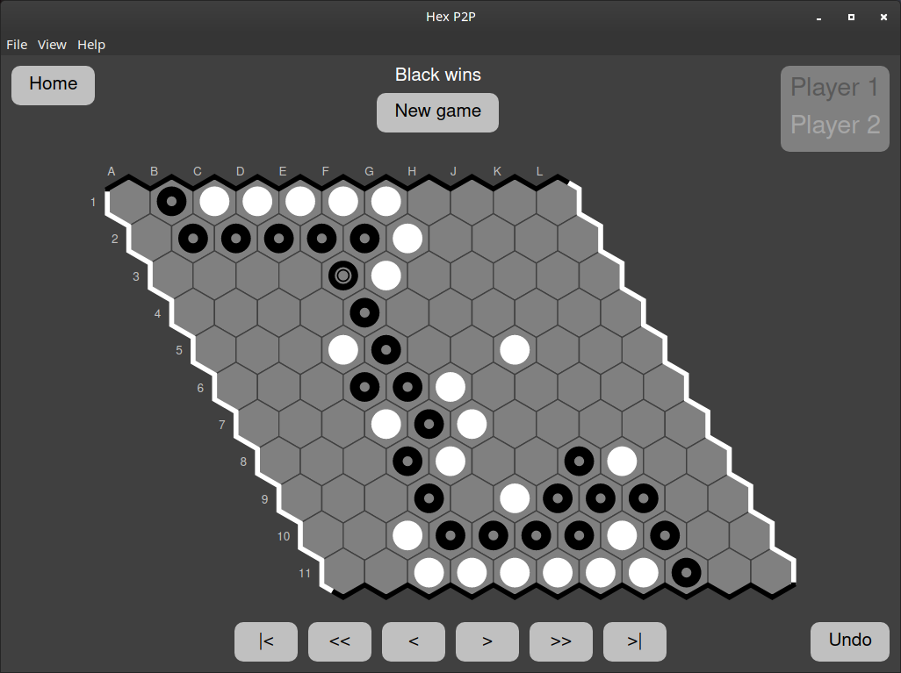

# Hex P2P

A web app for playing Hex with a friend over the Internet, or locally.



Netplay messages are relayed through a [Firebase Realtime Database](https://firebase.google.com/docs/database).
Two players who know the same host code join the same "room" in the database
and exchange moves through it - there is no traversal/signaling server to run.

## Running locally

#### Dependencies

- [Node.js](https://nodejs.org) 14
- [npm](https://www.npmjs.com)

#### Instructions

1. Clone the repository and install dependencies.

```
git clone https://github.com/kevinsung/hexp2p.git
cd hexp2p
npm install
```

2. Set up Firebase (only needed for netplay; local play works without it).

   - Create a project at the [Firebase console](https://console.firebase.google.com/).
   - Enable **Anonymous** sign-in under Authentication > Sign-in method.
   - Create a **Realtime Database** and deploy `database.rules.json` as its
     security rules (Database > Rules), or via the CLI:
     `firebase deploy --only database`.
   - Add a Web app to the project and copy its config into a `.env` file at
     the repository root (see `.env.example` for the expected variable
     names). This config is not secret - it is bundled into the client and
     access is controlled by the database rules above.

3. Start the dev server.

```
npm start
```

This serves the app at http://localhost:1212.

## Building for production

```
npm run build
```

The static site is emitted to `dist/`. Serve it with any static file host.
Pushes to `master` are automatically built and deployed to
[GitHub Pages](https://kevinsung.github.io/hexp2p/) by
`.github/workflows/publish.yml`.

## Rules of Hex

The players (Black and White) take turns selecting a hexagon to fill with their color.
A player wins when they have built a solid chain between the two edges of their color.
The screenshot at the top of this page demonstrates a winning configuration for Black.

### The swap rule

Normally, the game is played using the swap rule in order to mitigate the advantage of
playing first. Under the swap rule, Black makes the first move, and then White chooses
whether or not to swap pieces with Black. If White chooses to swap pieces, then Black's
move is replaced with the equivalent White move, and then it is Black's turn. Play then
continues as normal.

## License

Copyright (C) 2021 Kevin J. Sung.

Licensed under the AGPLv3. See [LICENSE](./LICENSE).
